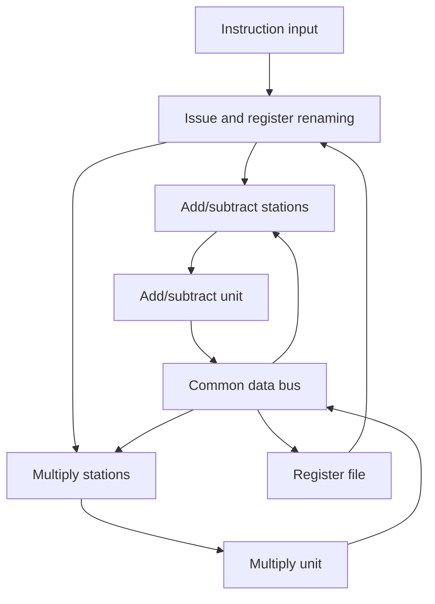
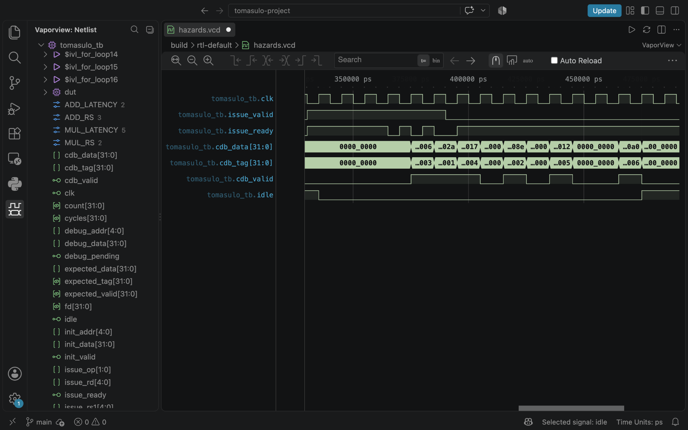

# Tomasulo Out-of-Order Execution

A SystemVerilog implementation of a Tomasulo-style integer execution backend,
with a Python reference model and automated verification.

The design uses reservation stations, register renaming, and a common data bus
(CDB) to execute ready instructions while older instructions wait for operands.
The Python model produces cycle-by-cycle traces and checks the final results
against a sequential interpreter.

## Design

The RTL supports `ADD`, `SUB`, and `MUL` with the following default configuration:

| Resource | Configuration |
|---|---|
| Register file | 32 registers, 32 bits each; R0 is always zero |
| Instruction issue | One instruction per cycle, in program order |
| Add/subtract stations | 3 |
| Multiply stations | 2 |
| Execution units | One add/subtract unit and one multiply unit |
| Execution latency | 2 cycles for ADD/SUB; 5 cycles for MUL |
| Result broadcast | One CDB; oldest completed instruction takes priority |

Ready instructions are selected by age within each execution group. Instructions
waiting for operands stay in their reservation stations. Each source holds either
a ready value or the tag of the instruction that will produce it.



`rtl/tomasulo_core.sv` contains the register file, rename table, reservation
stations, execution control, and CDB arbitration. `tb/tomasulo_tb.sv` drives the
instruction interface and checks it against expected results from the model.

The Python model also supports `ADDI`, signed `DIV`, and ordered `LD`/`ST`
operations. These additional instructions are not implemented in RTL.

## Verification

Directed tests cover:

- RAW dependencies and operand wakeup
- WAR and WAW hazards
- Reading a source before renaming the same destination register
- Simultaneous results competing for the CDB
- Full reservation stations and station reuse
- R0 handling, integer overflow, and reset

The Python suite includes 500 randomized programs with 64 instructions each.
The RTL regression uses eight directed cases and 200 randomized programs per
configuration. It checks issue timing, CDB tag/data on every cycle, all final
registers, and reset during in-flight work.

Recorded results:

| Run | Result |
|---|---|
| Python tests on macOS | 28 tests passed, including the 500-program random test |
| RTL default configuration, macOS/Icarus Verilog | 208 cases passed; 20,407 cycles checked |
| RTL one-station, one-cycle configuration, macOS/Icarus Verilog | 208 cases passed; 15,993 cycles checked |
| RTL default configuration, Linux/Verilator | 208 cases passed; 20,407 cycles checked |
| RTL one-station, one-cycle configuration, Linux/Verilator | 208 cases passed; 15,993 cycles checked |

Tool versions, test provenance, and coverage limits are recorded in
[validation results](docs/validation.md). Both RTL configurations passed on
macOS: **416 cases and 36,400 cycles checked** in total.

## Example Result

The six-instruction example in `examples/hazards.asm` includes an older multiply
and a younger subtraction writing R8. The subtraction completes first. When the
multiply later broadcasts, its dependent instruction receives the result, while
R8 retains the value written by the younger instruction.

| Instruction | Issue | Start | End | Writeback |
|---|---:|---:|---:|---:|
| MUL R8, R1, R2 | 1 | 2 | 6 | 7 |
| ADD R9, R8, R3 | 2 | 8 | 9 | 10 |
| SUB R8, R4, R5 | 3 | 4 | 5 | 6 |
| ADD R3, R6, R7 | 4 | 6 | 7 | 8 |
| MUL R10, R8, R7 | 5 | 7 | 11 | 12 |
| ADD R11, R9, R10 | 6 | 13 | 14 | 15 |

The program finishes in **15 modeled cycles**, with **R8 = 6**, **R9 = 142**,
**R10 = 18**, and **R11 = 160**. All 32 registers match the sequential reference.

The [detailed walkthrough](docs/project_guide.md#7-complete-worked-example)
explains the operand versions and timing. Saved traces and a simulated RTL
waveform are available in `demo/`.

## Waveform



Captured in VaporView after the default RTL regression on macOS. The CDB
broadcasts instruction tags **3, 1, 4, 2, 5, 6**, showing out-of-order
completion. Their hexadecimal results are **06, 2a, 17, 8e, 12, a0**
(decimal 6, 42, 23, 142, 18, 160). Read tag/data when `cdb_valid` is high;
values between valid broadcasts are not results.

## Running the Project

Python 3.10 or newer is required. The Python model uses the standard library.

```bash
git clone https://github.com/Vraj1026/tomasulo-out-of-order-execution.git
cd tomasulo-out-of-order-execution
bash run.sh
```

The script runs the Python tests and hazard example. Open
`build/hazards/trace.html` in a browser to step through the timeline, reservation
stations, registers, and CDB events. On macOS:

```bash
open build/hazards/trace.html
```

Run the RTL tests with Icarus Verilog installed:

```bash
python3 scripts/verify_rtl.py --backend iverilog
python3 scripts/verify_rtl.py --backend iverilog --profile tiny
```

Alternatively, use `--backend verilator` with Verilator 5.x, a C++ compiler, and
`make`. The default regression produces `build/rtl-default/hazards.vcd`, which
can be opened in a VCD waveform viewer.

See [local verification](docs/local_verification.md) for tool checks and how to
capture results. Recorded RTL runs use Icarus Verilog on macOS and Verilator
on Linux.

## Project Structure

| Directory | Contents |
|---|---|
| `rtl/` | SystemVerilog execution backend |
| `tb/` | Self-checking hardware testbench |
| `tomasulo/` | Python model, parser, sequential reference, and trace viewer |
| `tests/` | Python directed and randomized tests |
| `scripts/` | RTL regression and resource experiments |
| `examples/` | Assembly programs and configuration example |
| `demo/` | Saved trace, timing table, and VCD waveform |
| `docs/` | Design explanation, verification records, and references |

## Scope

This is an execution backend with an external instruction input. It does not
include instruction fetch/decode, branches, a reorder buffer, or precise
exceptions. Memory operations are currently available only in the Python model.

Execution latencies are modeled with counters. The RTL multiplier is not a
physically pipelined multiplier, and no synthesis, FPGA, frequency, area, or
power results are claimed.

## Tools and References

- SystemVerilog and Python
- Icarus Verilog and Verilator for RTL simulation
- VaporView for waveform inspection
- GitHub Actions workflow
- Offline HTML trace viewer and VCD waveform output

