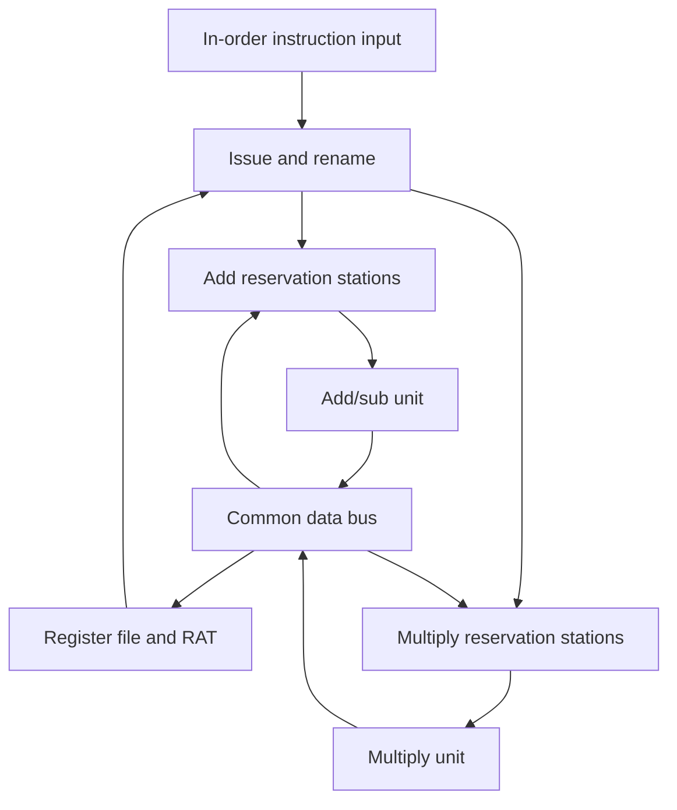

# Detailed project guide

## 1. The problem this project solves

Consider a multiply that takes five cycles, an addition that needs its result,
and another addition whose operands are already available. A processor can do
useful work during the multiply if it can identify the independent operation
and protect the dependent operation from using the wrong value.

Tomasulo-style scheduling tracks *which instruction produces each operand*.
Reservation stations hold waiting instructions; producer tags distinguish
different versions of a register; a common data bus distributes results to
waiting consumers. The University of Edinburgh's
[algorithm explanation](https://homepages.inf.ed.ac.uk/rni/comp-arch/Paru/tom-alg.html)
describes this tag-based dependency mechanism. Its
[HASE project](https://www.icsa.inf.ed.ac.uk/research/groups/hase/models/tomasulo/tomasulo.html)
also shows the original algorithm's relationship to separate arithmetic units.

This project makes those mechanisms visible. You can inspect the architectural
result, the timing of every instruction, the changing tag table, and the actual
RTL waveform. The timing and integer ISA described below are this project's
explicit design choices.

## 2. Three kinds of register dependency

| Hazard | Example in program order | What must be protected? | Mechanism here |
|---|---|---|---|
| RAW: read after write | `MUL R8,R1,R2`; `ADD R9,R8,R3` | The add needs the multiply's result | Consumer waits on the multiply's tag |
| WAR: write after read | `ADD R9,R8,R3`; `ADD R3,R6,R7` | The first add needs the old R3 | Capture old value or producer tag at issue |
| WAW: write after write | `MUL R8,R1,R2`; `SUB R8,R4,R5` | The younger writer defines final R8 | RAT identifies the youngest issued writer |

RAW is a true data dependency. Renaming preserves it. WAR and WAW arise from
reusing register names. Renaming separates the relevant versions so those
instructions need not wait solely because their register names overlap.

“Out of order” means an instruction can **begin execution or finish** before
an older instruction. This design still **issues instructions in program
order**, one per cycle. In a more elaborate processor, “issue” may mean dispatch
from the scheduler to a functional unit; this project calls that event “start.”

## 3. Architecture



This diagram describes the shared arithmetic subset. The Python model adds
divide to the multiply group, immediate addition to the add group, and a third
station group for ordered memory operations.

### Register file and register alias table

`regs[r]` stores a 32-bit value. `rat[r]` is either no producer (`None` in Python,
zero in RTL) or a producer tag. When a tag is present, the stored register value
may be stale and must not be read as a ready source operand.

Example:

| Register | Stored value | RAT tag | Interpretation |
|---|---:|---|---|
| R1 | 6 | — | Ready value 6 |
| R8 | 0 | T1 | Wait for instruction 1 |
| R9 | 0 | T2 | Wait for instruction 2 |

R0 always contains zero and is never renamed. An instruction whose destination
is R0 still consumes a station, executes, and broadcasts; its register write is
discarded. Its result does not become a source version of R0.

### Reservation station entry

| Field | Meaning |
|---|---|
| `tag` | Unique instruction sequence number: T1, T2, ... |
| `slot` | Physical storage slot, such as ADD0 or MUL1 |
| `inst.op` | Operation |
| `inst.dst` | Architectural destination, absent for stores |
| `a.value` / `Vj` | First operand value when ready |
| `a.tag` / `Qj` | Producer needed for the first operand |
| `b.value` / `Vk` | Second operand value when ready |
| `b.tag` / `Qk` | Producer needed for the second operand |
| `state` | Waiting, executing, or complete |
| `remaining` | Execution cycles still required |
| `result` | Completed result waiting for the CDB |

A station is storage, not a functional unit. Three add stations can hold three
instructions even though only one add operation executes at a time in the
default machine. Waiting instructions do not occupy a functional unit.

The instruction tag and station slot are separate. ADD0 can be reused for many
different tags. The RTL uses 32-bit sequence tags and assumes fewer than 2^32−1
accepted instructions between resets. It does not implement tag wrap recovery.

## 4. Issue: the order of these operations matters

The input instruction can issue only if a station in its group is free. If that
group is full, issue stalls; the next instruction cannot bypass it even when
the next instruction belongs to a different group.

At issue:

1. Allocate a free station and assign a unique producer tag.
2. For each source register, inspect its current RAT entry.
3. If it has no producer, copy the value into the station.
4. Otherwise, copy the producer tag into the station.
5. Only after reading both sources, rename the destination to this instruction.

In simplified form:

```python
a = read_source(src1)       # value OR producer tag
b = read_source(src2)
station = allocate(a, b, new_tag)
if destination != 0:
    RAT[destination] = new_tag
```

For `ADD R1,R1,R2`, renaming R1 before reading it would make the add wait for
itself. That is a deadlock. The supplied self-destination test detects this bug.

Issue occurs after this cycle's writeback effects are applied. A newly issued
instruction can therefore capture a result broadcast on the same edge. The
RTL implements this by reading the updated `regs_d` and `rat_d` arrays before
updating the new destination tag.

## 5. Execute: choose ready instructions

An arithmetic instruction can start when both operand tags are clear and a
unit in its group is available. Among competing ready instructions, choose the
oldest tag. A waiting older instruction does not block a ready younger one.

The default units are non-pipelined. A multiply holds its unit for all five
execution cycles. The unit can start another multiply in the cycle following
completion. Once the result is complete, the station retains it until
broadcast; a CDB stall does not keep the functional unit occupied.

The simulator first chooses starters from **start-of-cycle state**, before
applying the current broadcast. A consumer that receives a value this cycle
must wait until the next cycle to start. This avoids accidentally modeling a
zero-delay CDB-to-execution path.

For a start at cycle `s` and latency `L`:

\[
\text{end} = s + L - 1, \qquad \text{writeback} \geq \text{end} + 1
\]

A latency-one instruction still has distinct issue, execution, and writeback
cycles. CDB arbitration can make writeback later than the earliest bound.

## 6. Writeback: broadcast to consumers, conditionally update registers

A CDB message contains a **producer tag and a value**. Every waiting operand
checks whether its producer tag matches. All matching operands receive the
value simultaneously and clear their tags.

The architectural destination is updated only when the RAT still names that
producer:

```python
for consumer in stations:
    wake_matching_operands(consumer, broadcast_tag, value)

if RAT[destination] == broadcast_tag:
    registers[destination] = value
    RAT[destination] = None
```

The wakeup is unconditional with respect to the destination's current RAT
entry. An older result can still be required by an older consumer even when a
younger instruction has renamed the destination. Dropping that result entirely
would break RAW dependencies.

If two results are complete and only one CDB is available, the smaller sequence
tag wins. The losing station remains complete and retries next cycle. Results
are not recomputed, discarded, or treated as new instructions.

## 7. Complete worked example

The initial values in `examples/hazards.asm` are R1=6, R2=7, R3=100, R4=8,
R5=2, R6=20, and R7=3.

```asm
I1: MUL R8,  R1, R2     # old R8 version = 42
I2: ADD R9,  R8, R3     # needs 42 and old R3=100
I3: SUB R8,  R4, R5     # new R8 version = 6
I4: ADD R3,  R6, R7     # new R3 version = 23
I5: MUL R10, R8, R7     # needs new R8=6, so result=18
I6: ADD R11, R9, R10    # result=160
```

The `I1:` labels here are annotations only; do not paste them into the parser.
The supplied assembly file has the accepted syntax without labels.

| Instruction | Issue | Execute start | Execute end | Writeback |
|---|---:|---:|---:|---:|
| I1 MUL R8,R1,R2 | 1 | 2 | 6 | 7 |
| I2 ADD R9,R8,R3 | 2 | 8 | 9 | 10 |
| I3 SUB R8,R4,R5 | 3 | 4 | 5 | 6 |
| I4 ADD R3,R6,R7 | 4 | 6 | 7 | 8 |
| I5 MUL R10,R8,R7 | 5 | 7 | 11 | 12 |
| I6 ADD R11,R9,R10 | 6 | 13 | 14 | 15 |

### Cycles 1–3: create the dependency versions

I1 issues with ready values 6 and 7 and sets RAT[R8]=T1. It starts in cycle 2.
I2 issues in cycle 2. Its first operand is Qj=T1; its second operand is the
captured value 100. In cycle 3, I3 issues and changes RAT[R8] to T3. I2 still
waits on T1 because its source version was fixed when it issued.

### Cycles 4–6: independent instructions make progress

I3 executes in cycles 4–5 while I2 waits. I4 issues in cycle 4 and renames R3 to
T4. That does not change I2's captured value 100. I5 issues in cycle 5 and waits
for T3, the younger version of R8.

In cycle 6, I3 broadcasts 6. R8 becomes ready with value 6 and I5 captures 6.
I4 starts that cycle; I1 finishes its multiply. I5 cannot start until cycle 7.

### Cycles 7–10: the late multiply is still useful

In cycle 7, I1 broadcasts 42. I2 receives it, but R8 is not overwritten: its RAT
no longer names T1. I5 starts multiplying 6×3. In cycle 8, I2 starts adding
42+100 even though I4 writes R3=23 on that edge. I2's source was captured earlier.
I2 finishes in cycle 9 and broadcasts 142 in cycle 10.

### Cycles 11–15: final dependency

I5 finishes in cycle 11 and broadcasts 18 in cycle 12. I6 now has both operands,
starts in cycle 13, finishes in cycle 14, and broadcasts 160 in cycle 15.

This single example demonstrates a true dependency, two register-name hazards,
overlap between different units, out-of-order completion, and multiple operand
versions. The test suite asserts this exact timeline as well as the values.

## 8. Memory behavior in the Python model

For `LD R3,offset(R1)`, the base register is a tagged operand, the offset is an
immediate, and the effective address is the low 32 bits of base+offset. A load
reads one aligned word and broadcasts its result normally.

For `ST R3,offset(R1)`, the station captures both the base-register version and
the store-data version. It waits for both. After execution, it writes memory in
the following cycle. Stores do not use the CDB and do not rename a destination.

All memory operations are serialized in program order. A younger memory
operation cannot start until every older memory operation has left its station.
This rule preserves both store-to-load and load-to-store ordering even when an
older address is unknown. It also prevents independent memory accesses from
overlapping; that is an intentional simplification.

`examples/memory.asm` loads 10, multiplies by 7, stores 70, reloads 70, subtracts
1 with ADDI, and stores 69. Its final memory contains address 64=10, 68=70,
72=69. It takes 26 cycles under the default model.

This design has no store-to-load forwarding, disambiguation predictor, cache,
TLB, or speculative loads. Those require additional ordering and recovery rules.

## 9. Integer semantics and faults

All register values are 32-bit bit patterns. ADD, SUB, ADDI, and MUL retain the
low 32 bits. The viewer displays both signed decimal and hexadecimal forms.
MUL's low 32 bits are the same for signed and unsigned interpretations.

DIV interprets operands as signed two's-complement values, truncates toward
zero, and writes the low 32 bits. Division by zero produces `0xffffffff`.
`0x80000000 / 0xffffffff` produces `0x80000000`. These are explicit semantics of
this teaching ISA; they do not imply a complete RISC-V implementation.

Invalid syntax, registers, initial memory, or configuration produce errors.
Unaligned or out-of-range effective addresses stop simulation. There is no
precise architectural exception mechanism: older and younger operations may
already have updated state before a runtime memory error. Error termination is
not a recoverable CPU trap.

## 10. Reading the SystemVerilog

`tomasulo_core.sv` integrates the register file, RAT, reservation stations,
selection logic, arithmetic result storage, and CDB. This keeps the state
transition visible in one place.

`*_q` arrays hold current state. The `always_comb` block copies them into `*_d`,
makes decisions from current state, and applies next-state updates. The
`always_ff` block transfers `d` into `q` on the rising edge or performs a
synchronous active-low reset. This structure avoids blocking/nonblocking races
between separately clocked wakeup, rename, and execution blocks.

The station index determines the unit group: indices below `ADD_RS` are add/sub
stations; the remaining indices are multiply stations. Readiness checks use
`qj_q==0 && qk_q==0`. Selection uses instruction tags, not slot index, because a
reused low-numbered slot can contain a younger instruction.

### Input and debug protocol

An instruction is accepted on a rising edge only when `issue_valid` and
`issue_ready` are both high. The upstream producer must hold opcode and register
fields stable while valid is asserted and ready is low. Opcode 3 is invalid and
is never accepted. There is no frontend instruction queue inside the core.

`init_valid`, `init_addr`, and `init_data` write debug initialization values only
while the machine is idle and `issue_valid` is low. The testbench uses that
interface before beginning the measured instruction stream. `debug_addr` reads
the stored register value, and `debug_pending` identifies a pending producer.

`idle` means all reservation stations are empty. It does not promise that an
upstream producer will never send another instruction. Reset clears stations,
registers, RAT entries, and the sequence counter.

### Hardware latency limits

The arithmetic expressions calculate a result at dispatch and counters delay
its visibility until the configured execution latency. The multiply expression
is not a physically pipelined multiplier. Declaring a five-cycle latency does
not prove that this RTL meets any particular clock period.

The core is written with synthesizable constructs. Current verification covers
simulation and lint only. Synthesis, FPGA mapping, static timing,
resource utilization, area, and power have not been measured. The testbench
contains simulation-only file I/O and delays and is not synthesizable.

## 11. Verification strategy

Correct final values alone are insufficient. A completely sequential
implementation can produce correct values while failing to implement the
intended schedule. Conversely, a plausible schedule can still carry the wrong
operand version.

The checks therefore use three levels:

1. **Architectural oracle:** `reference.py` executes instructions in order using
   separate arithmetic code, without reservation stations, tags, or CDBs.
2. **Cycle checks:** directed Python tests assert known timings, arbitration,
   issue stalls, memory ordering, and same-cycle interactions.
3. **RTL comparison:** generated cases provide expected issue and CDB signals
   on every algorithm cycle, then expected final register values.

The Python random test generates 500 seeded programs of 64 instructions, using
all seven operations, overflow-prone values, reused registers, and varied
station counts, unit counts, latency, and CDB width. A subtest identifies the
seed if an architectural mismatch occurs.

The RTL regression uses eight directed cases and 200 seeded programs of 48
ADD/SUB/MUL instructions. It compares the same programs under default settings
and a one-station-per-group, one-cycle-latency setting. A failing RTL case saves
its assembly and preserves its input vectors. Every successful case also tests
reset with an accepted multiply in flight.

The model checks structural invariants after every cycle: R0 stays zero, active
tags and slots are unique, every pending producer exists, dependencies point
to older instructions, and station/unit capacities are respected.

These are directed and randomized tests, not formal verification or a 100%
functional-coverage claim. The random tests use a shared parser, so parser
validation is tested separately. The RTL timing oracle is the Python model;
the hand-checked timeline provides an independent timing anchor.

## 12. Performance experiments

Run `python3 scripts/experiments.py` to compare default resources with more
stations, more units, and more CDB bandwidth. Every run must still match the
same sequential architectural state. Results are written to
`build/experiments.csv`.

Observed cycles in the recorded resource sweep:

| Program | Default | Two CDBs | More stations | Two units per compute group | Wider resources |
|---|---:|---:|---:|---:|---:|
| hazards | 15 | 15 | 15 | 15 | 15 |
| parallel | 12 | 12 | 12 | 10 | 10 |
| cdb_contention | 11 | 11 | 11 | 10 | 10 |
| memory | 26 | 26 | 26 | 26 | 26 |

The parallel program benefits from additional arithmetic units. The hazard
program remains limited by its dependency chain. In the CDB example, widening
the bus removes one result's arbitration delay, but the final add is still
limited by add-unit availability, leaving total runtime unchanged. The memory
example remains limited by its dependencies and serialized memory accesses.

The reported IPC is completed program instructions divided by modeled cycles.
It is not an in-order-retirement statistic, because there is no ROB. No
real-machine frequency or benchmark speedup is implied.

The stall metrics also have different units. `issue_stall_cycles` counts clock
cycles. `operand_wait_instruction_cycles`, `fu_wait_instruction_cycles`,
`memory_order_wait_instruction_cycles`, and `cdb_wait_instruction_cycles` count
waiting instructions each cycle. Several instructions can wait during the same
cycle, so these quantities may exceed total cycles. Waiting reasons are counted
with priority: missing operands, then memory ordering, then unit availability.

## 13. Complexity

Let N be program length, C modeled cycles, S total station capacity, R register
count, M stored memory words, and B CDB width. The Python implementation uses
linear scans for selection and wakeup. Conservative memory ordering can scan
the active entries once per waiting memory operation, so a loose per-cycle
bound is O(S² + B·S + R). This favors clarity over simulator throughput.

Snapshots use approximately O(C·(S+R+M)) space, plus O(N) timeline storage.
`--no-trace` avoids snapshot storage. Exporting `report()` makes an independent
copy of the trace, which temporarily increases memory consumption.

These are software costs, not hardware timing estimates. Hardware broadcasts
require parallel tag comparisons and fanout; increasing station counts affects
area and timing even if the software simulator handles them easily.

## 14. Possible extensions

| Extension | Required work | Acceptance evidence |
|---|---|---|
| RTL ADDI | Immediate input, opcode expansion, source selection | Match Python on immediate overflow and self-destination cases |
| RTL memory | Ordered load/store buffers, tagged base/data, memory interface | Store-load and load-store hazard tests |
| Pipelined multiplier | Actual staged datapath and initiation interval | Overlapping multiplies, matched latency and result backpressure |
| ROB and precise commit | Ordered allocation/commit, completion storage, recovery | Younger writes cannot escape an older fault |
| Branch support | Decode/control flow, prediction policy, flush/recovery | Wrong-path results never reach committed state |
| UVM environment | Agents, sequences, scoreboard, coverage plan | Defined functional bins and reproducible regression results |
| FPGA demonstration | Synthesis wrapper, clock/reset constraints, board I/O | Tool reports, timing results, and captured board behavior |

These extensions are not implemented in the current backend.
